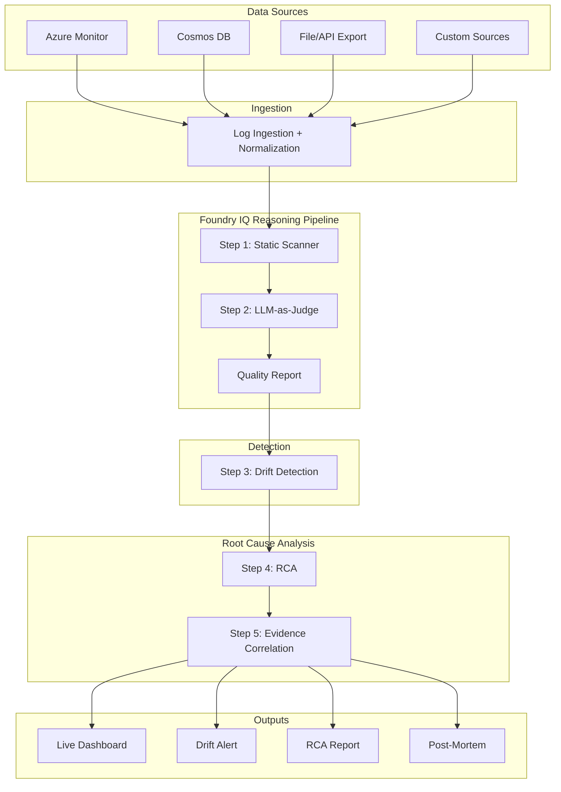

# 🔬 AgentEval AI

### Autonomous AI Agent Quality Monitor

**Microsoft Agents League Hackathon 2026 — Reasoning Agents Track**

_Detect AI quality regressions before your users do._

AgentEval continuously monitors AI agent outputs, evaluates response quality using LLM-as-Judge techniques, detects performance drift, performs automated root cause analysis (RCA), and generates actionable recommendations for remediation.

---

## 🚀 Overview

As AI copilots become embedded across products and enterprise workflows, maintaining response quality becomes increasingly difficult. Prompt updates, model upgrades, retrieval changes, and configuration drift can silently degrade performance without immediate visibility.

AgentEval provides an autonomous monitoring layer that continuously evaluates agent quality, detects degradation patterns, identifies likely causes, and generates recommendations before end users are impacted.

### Key Benefits

- 📊 Continuous AI quality monitoring
- 🔍 Automated drift detection
- 🧠 LLM-powered root cause analysis
- 🚨 Proactive alerting
- 📝 Auto-generated post-mortems
- ☁️ Microsoft Foundry IQ integration

---

## 🎯 Problem Statement

Organizations deploying AI copilots face several challenges:

- No standardized AI quality monitoring framework
- Silent quality degradation after prompt or model updates
- Lack of visibility into hallucination trends
- Difficulty identifying root causes of regressions
- Manual and time-consuming incident investigations

AgentEval solves these challenges through an autonomous evaluation and reasoning pipeline.

---

## 🏗️ Architecture



---

## ⚙️ How It Works

### Step 1 — Log Collection & Normalization

AgentEval ingests AI interactions from:

- Azure Monitor
- Azure Cosmos DB
- File exports
- REST APIs
- Custom data sources

All logs are normalized into a standard schema:

```json
{
  "user_input": "...",
  "agent_output": "...",
  "timestamp": "...",
  "agent_id": "..."
}
```

---

### Step 2 — Static Pre-Flight Scanner

Before invoking an LLM evaluator, AgentEval performs deterministic validation checks:

- Fake URL detection
- Sensitive information detection
- Impossible SLA claims
- Unsafe recommendations
- Policy violations

This provides low-cost, high-speed screening.

---

### Step 3 — LLM-as-Judge Evaluation

AgentEval uses Claude as an evaluation model to score outputs across five dimensions:

| Dimension           | Weight | Icon |
| ------------------- | ------ | ---- |
| Accuracy            | 25%    |
| Relevance           | 20%    |
| Hallucination Risk  | 25%    |
| Reasoning Coherence | 15%    |
| Safety              | 15%    |

Each response receives:

- Overall quality score
- Risk classification
- Dimension-level breakdown
- Evaluation rationale

---

### Step 4 — Drift Detection

Quality metrics are continuously compared against historical baselines.

Drift severity levels:

| Severity | Description               |
| -------- | ------------------------- |
| Minor    | Small deviation           |
| Moderate | Noticeable degradation    |
| Severe   | Significant quality loss  |
| Critical | Immediate action required |

When degradation exceeds configured thresholds, AgentEval automatically triggers Root Cause Analysis.

---

### Step 5 — Root Cause Analysis (RCA)

The RCA engine investigates quality degradation through:

- Pattern extraction
- Historical comparison
- Failure clustering
- Hypothesis generation
- Evidence correlation

Outputs include ranked root-cause candidates and remediation recommendations.

---

### Step 6 — Automated Reporting

AgentEval generates:

- RCA reports
- Incident summaries
- Post-mortem drafts
- Engineering recommendations

---

## ✨ Features

### 📊 Multi-Dimensional Quality Scoring

Evaluate agent outputs across:

- Accuracy
- Relevance
- Hallucination Risk
- Reasoning Quality
- Safety

### 📈 Drift Detection

Identify quality regressions automatically before users report issues.

### 🔍 Root Cause Analysis

Understand why quality changed instead of only knowing that it changed.

### 🚨 Alerting

Notify engineering teams through:

- Microsoft Teams
- Slack
- Email

### 📝 Automated Post-Mortems

Generate structured incident reports for rapid response.

### 📡 Real-Time Monitoring

Track quality trends and risk levels through a live dashboard.

---

## ☁️ Microsoft Foundry IQ Integration

AgentEval is designed around Microsoft Foundry IQ.

Foundry IQ orchestrates:

1. Data ingestion
2. Evaluation workflow
3. Drift analysis
4. RCA execution
5. Reporting pipeline

Benefits include:

- Traceability
- Observability
- Managed deployment
- Multi-step reasoning workflows

---

## 🛠️ Technology Stack

| Layer             | Technology                  |
| ----------------- | --------------------------- |
| **Orchestration** | Microsoft Foundry IQ        |
| **Backend API**   | FastAPI                     |
| **Quality Eval**  | Claude 3.5 Sonnet           |
| **Frontend**      | React 19 + Vite 6           |
| Drift Detection   | Python Statistical Analysis |
| **RCA Engine**    | Claude + Foundry IQ         |
| **Styling**       | Modern CSS (Flex/Grid)      |
| **Monitoring**    | Azure Monitor               |
| Storage           | Cosmos DB                   |

---

## 📂 Project Structure

```text
AgentEval/
├── frontend/                # React 19 SPA
│   ├── src/
│   │   ├── AgentEval.jsx    # Main Logic & UI
│   │   └── main.jsx         # Entry Point
│   └── package.json         # Vite 6 Config
│
├── quality_scorer.py        # Static + LLM Scoring
├── drift_detector.py        # Drift analysis logic
├── rca_engine.py            # Claude-powered RCA
│
├── agenteval_main.py        # FastAPI Entry (Uvicorn)
├── agenteval_routes.py      # REST Endpoints (/api/v1)
├── agenteval_requirements.txt # Python dependencies
└── .env                     # API Keys (Anthropic)
```

---

## ⚡ Quick Start

### Clone Repository

```bash
git clone https://github.com/kaushal-shivaprakashan/AgentEval-Autonomous-AI-Agent-Quality-Monitor.git

cd AgentEval-Autonomous-AI-Agent-Quality-Monitor
```

### Create Virtual Environment

```bash
python -m venv venv

source venv/bin/activate
```

### Install Dependencies

```bash
pip install -r agenteval_requirements.txt
```

### Configure Environment

```bash
echo "ANTHROPIC_API_KEY=YOUR_API_KEY" > .env
```

### Run Backend

```bash
uvicorn agenteval_main:app --reload --port 8000
```

### Run Frontend

```bash
cd frontend

npm install

npm run dev
```

---

## 🧪 Sample API Request

### Evaluate Agent Output

**Endpoint**

```http
POST /api/v1/eval/single
```

**Request**

```json
{
  "response": "The customer's issue has been resolved."
}
```

**Response**

```json
{
  "overall_score": 88,
  "risk_level": "LOW",
  "accuracy": 92,
  "relevance": 86,
  "hallucination_risk": 90,
  "reasoning": 84,
  "safety": 89
}
```

---

## 📊 Outputs

### Live Dashboard

Displays:

- Quality trends
- Drift history
- Evaluation metrics
- Risk indicators

### Drift Alerts

Automatic notifications via:

- Slack
- Microsoft Teams
- Email

### RCA Reports

Generated root cause investigations with ranked evidence.

### Post-Mortem Reports

Draft incident reports for engineering review.

---

## 🔮 Future Enhancements

- Azure OpenAI integration
- Real-time streaming evaluation
- Multi-agent benchmarking
- CI/CD quality gates
- Azure AI Foundry deployment templates
- Enterprise observability integrations
- Advanced trend forecasting

---

## 🏆 Hackathon Submission

Built for the **Microsoft Agents League Hackathon 2026** under the **Reasoning Agents Track**.

AgentEval demonstrates how AI systems can autonomously monitor, evaluate, diagnose, and improve the quality of other AI systems.

---

## 👨‍💻 Author

**Kaushal Shivaprakashan**

Seattle, Washington, USA

GitHub: https://github.com/kaushal-shivaprakashan

LinkedIn: https://linkedin.com/in/kaushalshivaprakash

## 👨‍💻 Contributor

**Saran Gowrish Velisetty**

GitHub: https://github.com/SaranGowrishVelisetty99
LinkedIn: https://www.linkedin.com/in/saran-gowrish-velisetty-382585238/

---

## 📜 License

MIT License

Copyright (c) 2026 Kaushal Shivaprakashan
